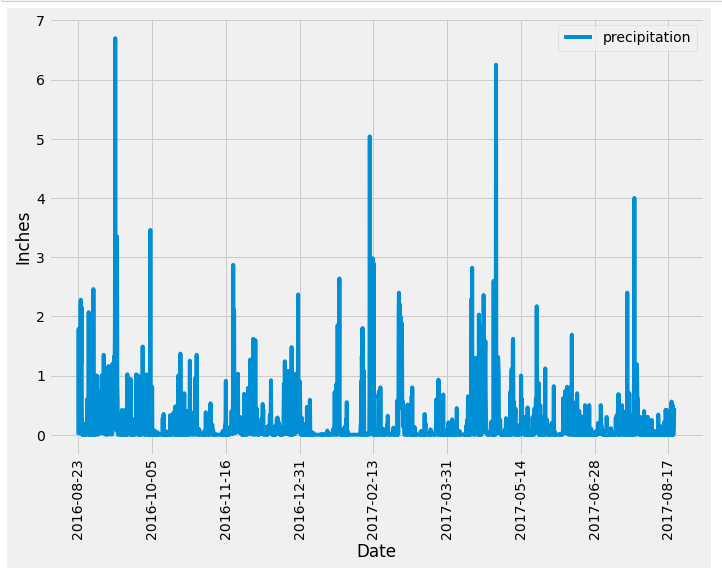
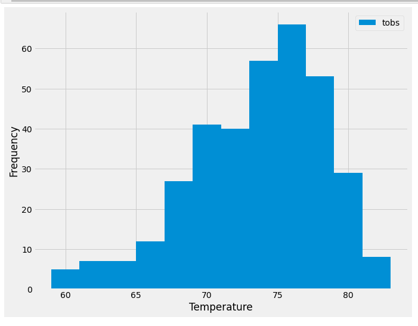

# sqlalchemy-challenge

This project is about climate analysis data of Honolulu, Hawaii for trip planning based on two  'havaii_stations.csv' and 'havaii_measurments.csv' files. In 'Climate.ipynb' Jupiter notebook, Python and SQLAlchemy are used for the folowing analysis:

###  Analyze and Explore the Climate Data

* The most recent date in the dataset is found.

* Using that date, the previous 12 months of precipitation data is retrived by querying the previous 12 months of data.

* Only the "date" and "prcp" values are selected.

* The query results are loaded into a Pandas DataFrame.

* The DataFrame values are sorted by "date".

* A plot is created based on that DataFrame by using the DataFrame plot method, as the following image shows:

* Pandas library is used to print the summary statistics for the precipitation data.

## Station Analysis

* A query is designed to calculate the total number of stations in the dataset.

* A query is designed to find the most-active stations (that is, the stations that have the most rows). To do so, the following steps are performed:

    * Listed the stations and observation counts in descending order.

    * Answered the following question: which station id has the greatest number of observations?

* A query is designed that calculates the lowest, highest, and average temperatures that filters on the most-active station id found in the previous query.

* A query is designed to get the previous 12 months of temperature observation (TOBS) data. To do so, the following steps are performed:

    * Filtered by the station that has the greatest number of observations.

    * Queried the previous 12 months of TOBS data for that station.

    * A plot is created based on the results as a histogram with bins=12, as the following image shows:

    

 

### Designing Climate App

A Flask API is designed based on the queries developed. It has the following routes:

1.        /
    * Start at the homepage
    * List all the available routes.

2.      /api/v1.0/precipitation
    * Convert the query results from your precipitation analysis (i.e. retrieve only the last 12 months of data) to a dictionary using date as the key and prcp as the value.
    * Return the JSON representation of your dictionary.

3.      /api/v1.0/stations
    * Return a JSON list of stations from the dataset.

4.      /api/v1.0/tobs
    * Query the dates and temperature observations of the most-active station for the previous year of data.
    * Return a JSON list of temperature observations for the previous year.

5.      /api/v1.0/stat
    * Return a JSON list of the minimum temperature, the average temperature, and the maximum temperature for a specified start or start-end range.
    * For a specified start, calculate TMIN, TAVG, and TMAX for all the dates greater than or equal to the start date.

6.      /api/v1.0/<start>/<end>
    *  * For a specified start date and end date, calculate TMIN, TAVG, and TMAX for the dates from the start date to the end date, inclusive.

  

## Setup   
 'vacation_planning_analysis' folder contains 'app.py' file which is the API file to run, 'climate.ipynb' notebook where all the analysis are done and 'Resources' folder which contains csv source files.
## References
This project is a part of UC Berkeley "Data Analysis and Visualisation" Boot Camp education services.

In projects' descriptions, some paragraphs are copy/pasted from 'Module 10 Challenge' of UC Berkeley Data Analytics and Visualisation Bootcamp course.
 
May-11-2023
